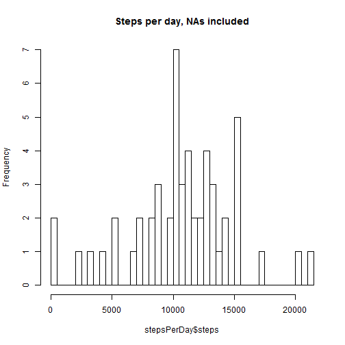
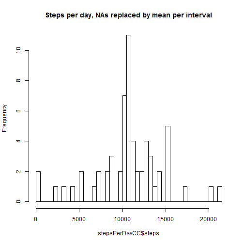
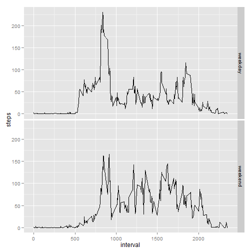

## Loading and preprocessing the data


```r
activityData <- read.csv("./activity/activity.csv")
head(activityData)
```

```
##   steps       date interval
## 1    NA 2012-10-01        0
## 2    NA 2012-10-01        5
## 3    NA 2012-10-01       10
## 4    NA 2012-10-01       15
## 5    NA 2012-10-01       20
## 6    NA 2012-10-01       25
```

## What is mean total number of steps taken per day?


```r
meanTotalPerDay <- aggregate(steps ~ date,activityData,mean,na.rm=T)
meanTotalPerDay
```

```
##          date      steps
## 1  2012-10-02  0.4375000
## 2  2012-10-03 39.4166667
## 3  2012-10-04 42.0694444
## 4  2012-10-05 46.1597222
## 5  2012-10-06 53.5416667
## 6  2012-10-07 38.2465278
## 7  2012-10-09 44.4826389
## 8  2012-10-10 34.3750000
## 9  2012-10-11 35.7777778
## 10 2012-10-12 60.3541667
## 11 2012-10-13 43.1458333
## 12 2012-10-14 52.4236111
## 13 2012-10-15 35.2048611
## 14 2012-10-16 52.3750000
## 15 2012-10-17 46.7083333
## 16 2012-10-18 34.9166667
## 17 2012-10-19 41.0729167
## 18 2012-10-20 36.0937500
## 19 2012-10-21 30.6284722
## 20 2012-10-22 46.7361111
## 21 2012-10-23 30.9652778
## 22 2012-10-24 29.0104167
## 23 2012-10-25  8.6527778
## 24 2012-10-26 23.5347222
## 25 2012-10-27 35.1354167
## 26 2012-10-28 39.7847222
## 27 2012-10-29 17.4236111
## 28 2012-10-30 34.0937500
## 29 2012-10-31 53.5208333
## 30 2012-11-02 36.8055556
## 31 2012-11-03 36.7048611
## 32 2012-11-05 36.2465278
## 33 2012-11-06 28.9375000
## 34 2012-11-07 44.7326389
## 35 2012-11-08 11.1770833
## 36 2012-11-11 43.7777778
## 37 2012-11-12 37.3784722
## 38 2012-11-13 25.4722222
## 39 2012-11-15  0.1423611
## 40 2012-11-16 18.8923611
## 41 2012-11-17 49.7881944
## 42 2012-11-18 52.4652778
## 43 2012-11-19 30.6979167
## 44 2012-11-20 15.5277778
## 45 2012-11-21 44.3993056
## 46 2012-11-22 70.9270833
## 47 2012-11-23 73.5902778
## 48 2012-11-24 50.2708333
## 49 2012-11-25 41.0902778
## 50 2012-11-26 38.7569444
## 51 2012-11-27 47.3819444
## 52 2012-11-28 35.3576389
## 53 2012-11-29 24.4687500
```

```r
mean(meanTotalPerDay$steps)
```

```
## [1] 37.3826
```


## What is the average daily activity pattern?
Make a time series plot (i.e. type = "l") of the 5-minute interval (x-axis) and 
the average number of steps taken, averaged across all days (y-axis)
(Only complete cases, sind this data rame is used later to replace NAs in the source data frame)


```r
stepsPerInterval <- aggregate(steps ~ interval,activityData[(complete.cases(activityData)),],mean)
with(stepsPerInterval,plot(interval,steps,type="l"))
```

 

Which 5-minute interval, on average across all the days in the dataset, contains 
the maximum number of steps?


```r
maxSteps <- max(stepsPerInterval$steps)
maxInterval <- stepsPerInterval[stepsPerInterval$steps %in% maxSteps,"interval"]
maxInterval
```

```
## [1] 835
```

## Imputing missing values
Calculate and report the total number of missing values in the dataset (i.e. 
the total number of rows with NAs)

```r
sum(!complete.cases(activityData))
```

```
## [1] 2304
```

Devise a strategy for filling in all of the missing values in the dataset. 
The strategy does not need to be sophisticated. For example, you could use 
the mean/median for that day, or the mean for that 5-minute interval, etc.
Create a new dataset that is equal to the original dataset but with the missing 
data filled in. 

My strategy: replace NAs by mean of steps per interval


```r
replaceNaByIntervalMean <- function(activityData) {
        for (i in 1:nrow(activityData)) {
                if (is.na(activityData[i,"steps"])) {
                        activityData[i,"steps"] <- stepsPerInterval[stepsPerInterval$interval == activityData[i,"interval"],"steps"] 
                } 
        }
        activityData
}

activityDataCC <- replaceNaByIntervalMean(activityData)
head(activityDataCC)
```

```
##       steps       date interval
## 1 1.7169811 2012-10-01        0
## 2 0.3396226 2012-10-01        5
## 3 0.1320755 2012-10-01       10
## 4 0.1509434 2012-10-01       15
## 5 0.0754717 2012-10-01       20
## 6 2.0943396 2012-10-01       25
```

Make a histogram of the total number of steps taken each day and Calculate and 
report the mean and median total number of steps taken per day. 


```r
stepsPerDay <- aggregate(steps ~ date,activityData,sum)
stepsPerDayCC <- aggregate(steps ~ date,activityDataCC,sum)
hist(stepsPerDay$steps,breaks=50,main="Steps per day, NAs included")
```

 

```r
summary(stepsPerDay$steps)
```

```
##    Min. 1st Qu.  Median    Mean 3rd Qu.    Max. 
##      41    8841   10760   10770   13290   21190
```

```r
hist(stepsPerDayCC$steps,breaks=50,main="Steps per day, NAs replaced by mean per interval")
```

 

```r
summary(stepsPerDayCC$steps)
```

```
##    Min. 1st Qu.  Median    Mean 3rd Qu.    Max. 
##      41    9819   10770   10770   12810   21190
```

Do these values differ from the estimates from the first part of the assignment? 
What is the impact of imputing missing data on the estimates of the total daily number of steps?
Yes, slightly. With replacing the NAs the quartile range is narrowed.

## Are there differences in activity patterns between weekdays and weekends?
Create a new factor variable in the dataset with two levels -- "weekday" and 
"weekend" indicating whether a given date is a weekday or weekend day.


```r
weekdaysOfDates <- weekdays(as.Date(activityDataCC$date))
partOfWeek <- function(days) {
        days[days == "Samstag" | days == "Sonntag"] <- "weekend"
        days[days != "weekend"] <- "weekday"
        days
}
activityDataCC$partOfWeek <- as.factor(partOfWeek(weekdaysOfDates))
head(activityDataCC)
```

```
##       steps       date interval partOfWeek
## 1 1.7169811 2012-10-01        0    weekday
## 2 0.3396226 2012-10-01        5    weekday
## 3 0.1320755 2012-10-01       10    weekday
## 4 0.1509434 2012-10-01       15    weekday
## 5 0.0754717 2012-10-01       20    weekday
## 6 2.0943396 2012-10-01       25    weekday
```

```r
str(activityDataCC)
```

```
## 'data.frame':	17568 obs. of  4 variables:
##  $ steps     : num  1.717 0.3396 0.1321 0.1509 0.0755 ...
##  $ date      : Factor w/ 61 levels "2012-10-01","2012-10-02",..: 1 1 1 1 1 1 1 1 1 1 ...
##  $ interval  : int  0 5 10 15 20 25 30 35 40 45 ...
##  $ partOfWeek: Factor w/ 2 levels "weekday","weekend": 1 1 1 1 1 1 1 1 1 1 ...
```

Make a panel plot containing a time series plot (i.e. type = "l") of the 
5-minute interval (x-axis) and the average number of steps taken, averaged 
across all weekday days or weekend days (y-axis).


```r
stepsPerIntervalCC <- aggregate(steps ~ interval + partOfWeek,activityDataCC,mean)
library("ggplot2")
ggplot(stepsPerIntervalCC,aes(x=interval,y=steps)) + geom_line() + facet_grid(partOfWeek~.)
```

 
